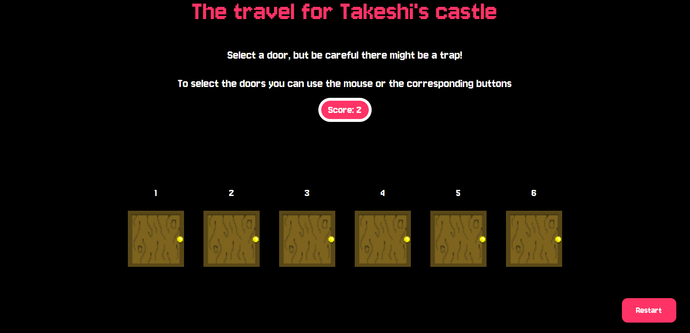
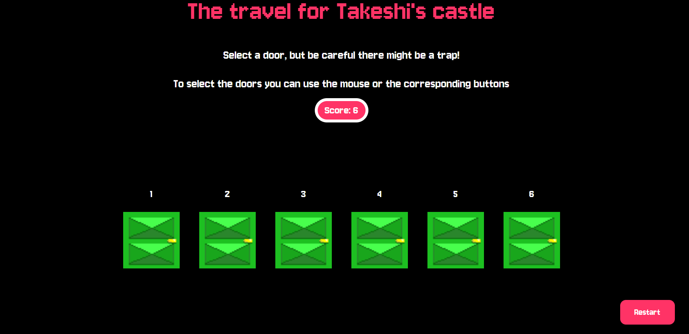
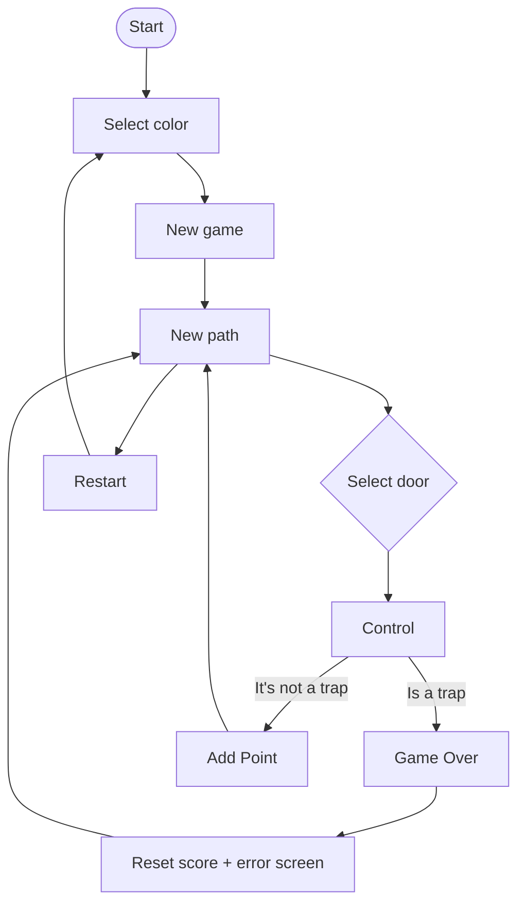

# Brief
Choose a “mini-game” to rebuild with HTML, CSS and JavaScript. The requirements are:

-The webpage should be responsive
-Choose an avatar at the beginning of the game
-Keep track of the score of the player
-Use the keyboard to control the game (indicate what are the controls in the page). You can also use buttons (mouse), but also keyboard.
-Use some multimedia files (audio, video, …)
-Implement an “automatic restart” in the game (that is not done via the refresh of the page)

## Project description
The Travel for Takeshi's Castle is inspired by the TV show Takeshi's Castle, especially by the mini-game "Knock Knock". In the real-life game, players must cross various stages where they need to choose the correct door; otherwise, they are eliminated. They are given a set of doors to choose from, some of them fake and others real.

In this project, the player must choose one of six doors without knowing which one is real and which ones are fake. For every correct door, the player earns a point; if they choose a wrong door, the score resets to zero.

The player can also choose a skin, which changes the color of the door.

## Screenshots

## Flowchart

## Function list
#### Controll(id)

Parameters:
id (The number of the door that was clicked or pressed) 
Logic:
First it check if the game is started (with: gameStarted). Then it add the dorr ID in to the user input (userInput.push(id)).
After this it compares the last selected door with the trap list that was created.
If the selected door is a trap it: reset the score (fail), play the fail sound (Soundfail.play()) and show the error popup (showErrorPopup()).
But if the dorr is not a trap: it cleares the array (userInput and trapsSequence), it create a new trap path (newPath()) and it adds a point in the score (AddPoint())

#### newPath()

Parameters:
None
Logic:
It add to the array trapsSequence two value (between 1 and 6) that represent 2 that are from the array. 
This number will be the trap door in the round.

#### AddPoint()

Parameters:
None
Logic:
It increases score by 1, it update ub the display (Points.innerHTML) and it play the "win" sound (Soundpoint.play())

#### changeToBrown() / changeToGreen() / changeToOrange()

Parameters:
None
Logic:
It changes all door skin/sound/video to the selected setting

#### showErrorPopup()

Parameters:
None
Logic: 
It displays the error popup when the player lose, it also stops the game (gameStarted = false)

## Content and data source

[Jersey 10](https://fonts.google.com/specimen/Jersey+10?query=pixel)

[Win Sound](https://freesound.org/people/Kenneth_Cooney/sounds/463067/)

[Fail Sound 1](https://freesound.org/people/Tissman/sounds/457756/)

[Fail Sound 2](https://freesound.org/people/GabrielAraujo/sounds/242503/)

[Fail Sound 3](https://freesound.org/people/Raclure/sounds/483598/)

The doors skin were made by my friend Mattia Di Siculo