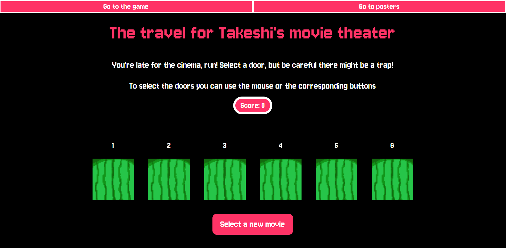
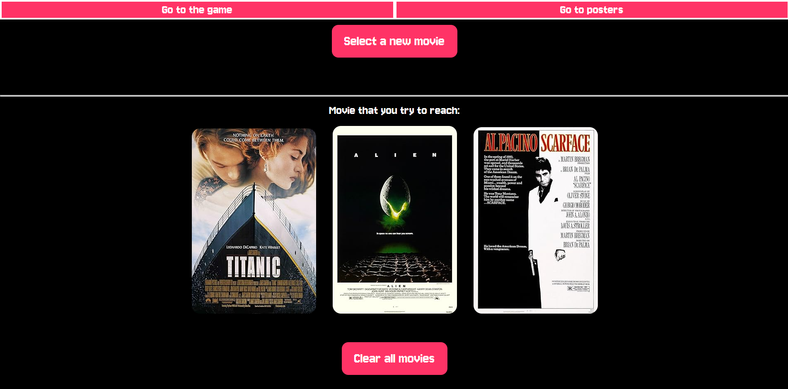
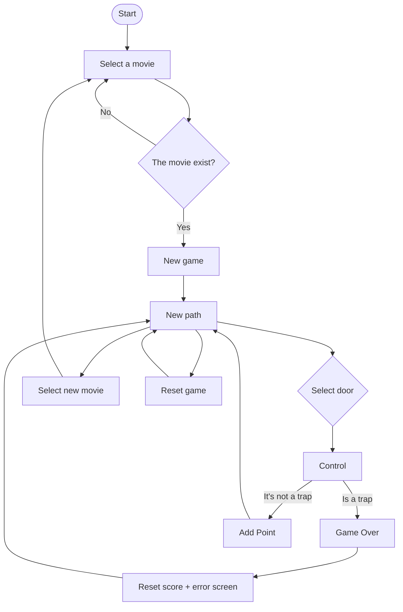

# Brief
Upgrade the **Assignment 02** by adding the use of data coming from an external web API. For example, fetch contents (audio, images, video, text, metadata) from online archives, AI generated contents (chatGPT API), data (weather, realtime traffic data, environmental data).

Have a look at the lesson about the API:

[https://wind-submarine-3d4.notion.site/Lesson-5-200d516637bc811aba69e13b0ffe438f?pvs=74](https://www.notion.so/200d516637bc811aba69e13b0ffe438f?pvs=21)

The application **must** have those requirements:

- The webpage is responsive
- Use a web API (you choose which one best fists for your project) to load the data and display them in the webpage
- At least one multimedia file (for user feedback interactions, or content itself)
- Develop a navigation system that allows the user to navigate different sections with related content and functionalities

## Project description
The challenge for Takeshi's movie theater is an evolution of the TV show Takeshi's Castle. In this case, the player must choose a movie (that exists in the IMDb catalog). Then they are given a set of doors to choose from, some fake and others real. In this project, the player must pick one of six doors without knowing which one is real and which ones are fake. For every correct door, the player earns a point; if they choose a wrong door, the score resets to zero.

The player must select a movie, and then the list of movies will be shown below on the site.

## Screenshots

## Flowchart

## Function list

#### fetchMovie()
Description: Reads the movie title from the search input, sends a request to the OMDB API using the movie title, parses the JSON response, and passes the data to searchMovie(). Clears the input field.

#### searchMovie(data)
Description:
Checks if the movie exists. If it's valid, it show: the game panel, shows the navbar inserts the movie poster, applies rating-based skins using searchrating(). The it starts the game (startgame()), but if is invalid it alerts the user

#### searchrating(data)
Description:
Extracts the IMDb rating and applies one of three themes depending on rating intervals: 0–3.9 → changeToOne(), 4–6.9 → changeToTwo(), 7–10 → changeToThree()

#### changeToOne()/changeToTwo()/changeToThree()
Description:
Switches the game’s door images, fail popup style, fail sound, and fail video to the selected style 1, regarding the rating of the movie

#### controll(id)
Arguments: id (string)
Description: Stops if the game has not started, it records player input. It checks if the chosen door is a trap (found in trapsSequence).
If incorrect: resets user input and trap sequence, shows error popup, resets score and it plays fail sound.
If correct: Clears user input and trap sequence, generates a new path and adds a point

#### newPath()
Description:
Generates a new trap sequence by randomly selecting two distinct doors (1 to 6) and storing them in trapsSequence.

#### startgame()
Description:
Marks the game as started, shows the game interface, hides the tutorial, and generates the first trap sequence.

#### AddPoint()
Description:
Increases the score by 1, updates the score display, and plays the “point earned” sound.

#### showErrorPopup()
Description:
Displays the error popup after a wrong choice, and temporarily stops the game.

## Content and data source

[Jersey 10](https://fonts.google.com/specimen/Jersey+10?query=pixel)

[Win Sound](https://freesound.org/people/Kenneth_Cooney/sounds/463067/)

[Fail Sound 1](https://freesound.org/people/Tissman/sounds/457756/)

[Fail Sound 2](https://freesound.org/people/GabrielAraujo/sounds/242503/)

[Fail Sound 3](https://freesound.org/people/Raclure/sounds/483598/)

The doors skin were made by my friend Mattia Di Siculo

The video are from Buster Keaton skins

## API documentation
[OMDb API](https://www.omdbapi.com/)
The OMDb API is a RESTful web service to obtain movie information, all content and images on the site are contributed and maintained by our users.
